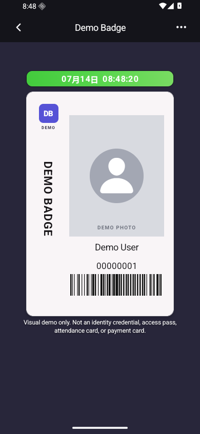

# Electronic Badge Demo

A brand-neutral, offline-first visual demo built with Expo 57 and React Native. It shows a live clock, editable demo identity, local photo selection, a generated demo barcode, local persistence, validation, cancel, and restore-default flows.

This repository is intentionally small. It is a UI demonstration, not a production credential system.



## Features

- Live clock with rolling time transitions and a moving highlight
- Editable demo name, demo ID, and local profile image
- `DEMO-`-prefixed barcode generated on device
- Local-only persistence with no account or backend
- Responsive layouts for common Android phone sizes

## Run locally

Requirements: Node.js 22.13 or later, Android Studio or an Android device, and Expo tooling.

```bash
npm install
npm run android
```

You can also start the Expo development server:

```bash
npm start
```

## Checks

```bash
npm run check
npx expo export --platform android
```

## Safety boundary

The displayed badge is fictional and must not be used as identification, an employee credential, an access pass, an attendance card, or a payment card. The app does not connect to access control, NFC, Bluetooth, identity verification, authentication, attendance, payment, or any production service.

Profile data and a selected image are stored only on the current device. No information is uploaded.

## License

MIT
